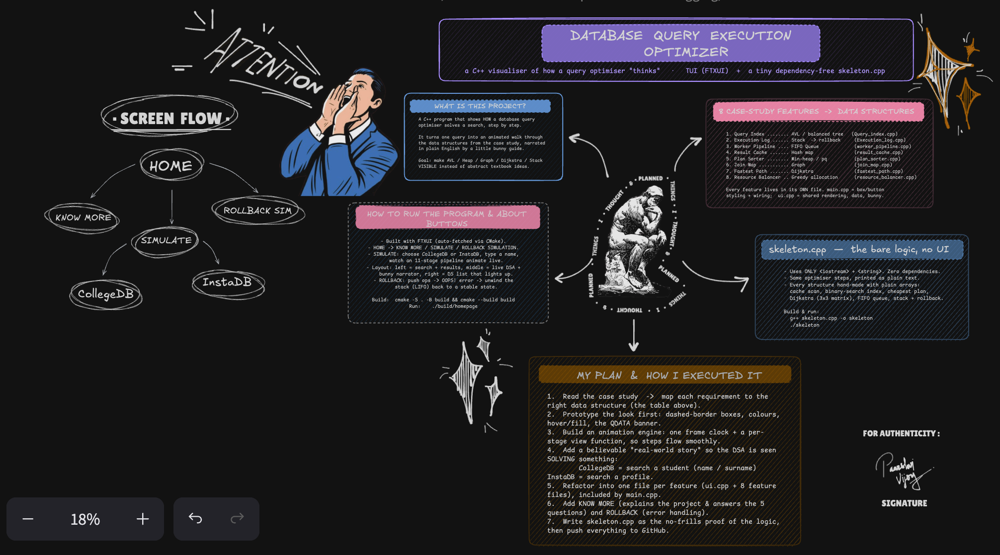
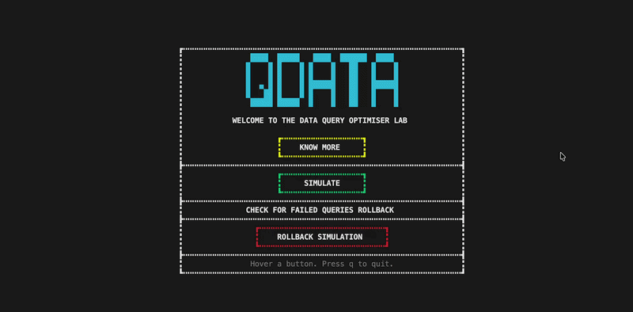
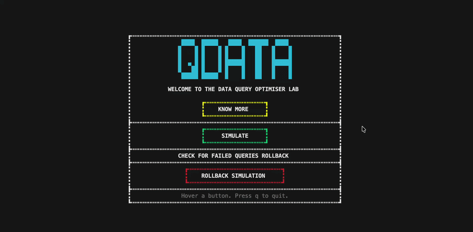
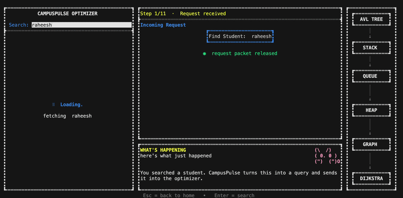
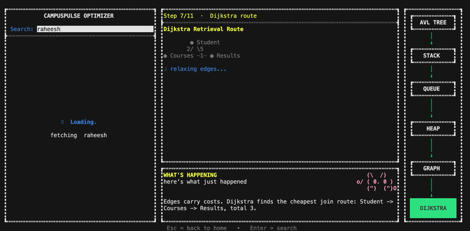
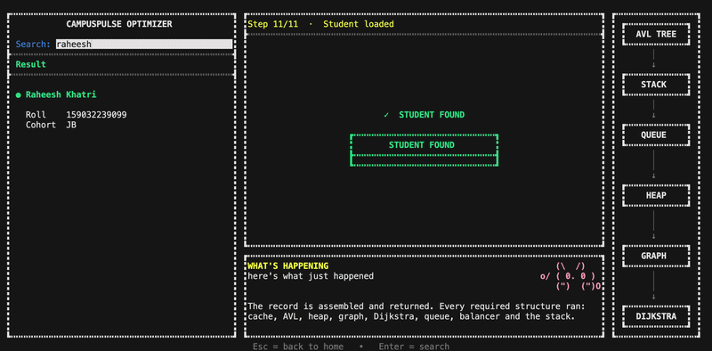
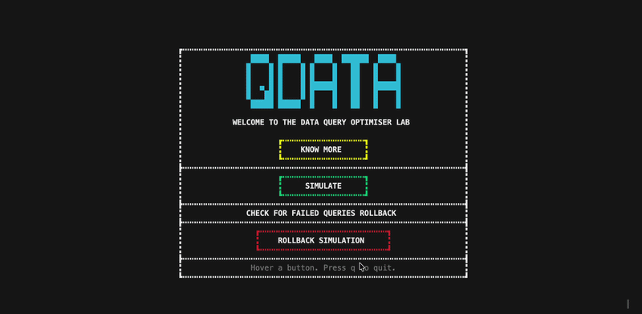
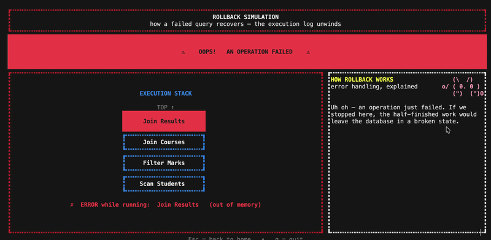
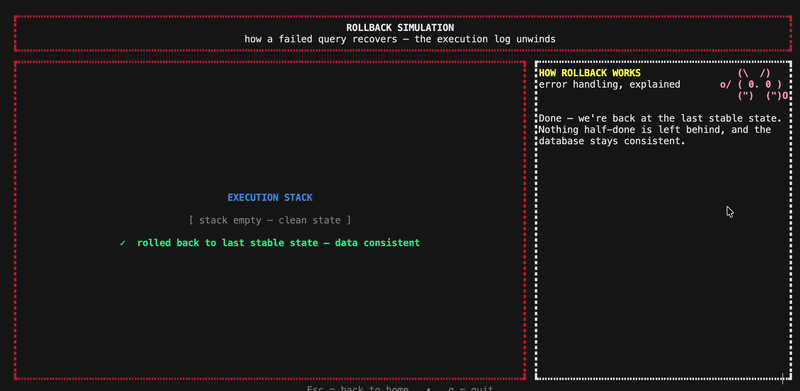

# Database Query Execution Optimizer

A C++ project that **visualises how a database query optimiser “thinks.”** It
turns a simple search into an animated, step-by-step walk through the core data
structures from the case study — narrated in plain English by a friendly guide —
and also ships the same logic as a tiny, dependency-free console program.

Built in C++ with [FTXUI](https://github.com/ArthurSonzogni/FTXUI).

---

## Problem Statement

*DataPulse* is a cloud database used by large enterprises to store and query
billions of rows across hundreds of tables. As data volume exploded, query
performance collapsed:

- Looking up specific data blocks is slow because the system **scans massive
  tables linearly**.
- When a complex query crashes midway, there is **no way to roll back** to the
  last stable state, leaving partially processed data behind.
- Background maintenance tasks (index rebuilds) **compete randomly** with user
  queries, causing unpredictable slowdowns.
- Frequently requested results are **recomputed from scratch** instead of being
  retrieved from a cache.
- When multiple ways exist to run the same query, the system **picks one
  arbitrarily** instead of the fastest.
- Under heavy load the system **cannot distribute processing power** smartly, so
  some queries hog resources while others time out.

The new system needs fast data-block lookups, reliable step-by-step rollback,
fair background-task scheduling, instant cached retrieval, ranking of execution
plans by cost, a relationship map between tables for joins, the optimal sequence
of joins/filters, and dynamic resource allocation under heavy load — implemented
in C++ with justified data-structure choices related to real systems like MySQL
and PostgreSQL.

---

## Objectives

1. Implement the eight must-have features of the case study, each backed by an
   appropriate data structure.
2. Make the optimiser's hidden reasoning **visible** through a live terminal
   animation, so each structure can be seen doing its job.
3. Provide a **dependency-free console version** (`skeleton.cpp`) that runs the
   real algorithms with one `g++` command.
4. Demonstrate the ideas on believable, domain-flavoured data (a college ERP and
   a social network) to show the optimiser is domain-independent.
5. Relate every feature to how a **real database (MySQL / PostgreSQL)** solves
   the same problem.

---

## System Overview / Architecture

The project ships **two programs**:

| Program | What it is |
|---|---|
| **`homepage`** (TUI) | The full interactive FTXUI app: **KNOW MORE**, **SIMULATE** (CollegeDB / InstaDB live search) and a **ROLLBACK SIMULATION**. |
| **`src/skeleton.cpp`** | A tiny no-UI console version (only `<iostream>` + `<string>`) running the same optimiser logic. |

**Animation engine.** A background “ticker” thread repaints the screen ~11× per
second. A wall-clock timestamp is converted into a `(stage, progress)` pair by a
fixed timeline of 11 stages; each render draws the current stage, so motion (bars
filling, cards revealing, the bunny blinking) comes for free.

**Screen flow.**
`HOME → KNOW MORE` (info) · `HOME → SIMULATE → CollegeDB / InstaDB` (type a name,
watch the pipeline) · `HOME → ROLLBACK SIMULATION` (push ops → error → unwind).

**Project structure (everything is in `src/`)** — one file per feature:

| File | Purpose |
|---|---|
| `src/main.cpp` | Box & button styling, screen wiring, animation clock, `main()`. `#include`s the rest (unity build). |
| `src/ui.cpp` | Shared UI: colours, banner, bunny narrator, datasets, timeline, result cards, KNOW MORE. |
| `src/result_cache.cpp` | Result Cache (hash map) |
| `src/Query_index.cpp` | Query Index (AVL tree) |
| `src/plan_sorter.cpp` | Plan Sorter (min-heap) |
| `src/join_map.cpp` | Join Map (graph) |
| `src/fastest_path.cpp` | Fastest Path (Dijkstra) |
| `src/resource_balancer.cpp` | Resource Balancer (greedy) |
| `src/worker_pipeline.cpp` | Worker Pipeline (FIFO queue) |
| `src/Execution_log.cpp` | Execution Log (stack) + rollback simulation |
| `src/skeleton.cpp` | The real algorithms, no UI |

---

## Data Structures and Algorithms Used

| # | Feature | Data structure | Algorithm |
|---|---|---|---|
| 1 | Query Index | AVL / balanced search tree | Tree / **binary search** — O(log n) lookup |
| 2 | Execution Log | Stack (LIFO) | push on execute, **pop to roll back** |
| 3 | Worker Pipeline | FIFO Queue | first-in-first-out scheduling |
| 4 | Result Cache | Hash map | O(1) average key lookup |
| 5 | Plan Sorter | Min-heap / priority queue | extract-min (cheapest plan) |
| 6 | Join Map | Graph (nodes = tables, edges = relationships) | graph construction |
| 7 | Fastest Path | Weighted graph | **Dijkstra's shortest path** |
| 8 | Resource Balancer | Array of loads | **greedy** least-loaded selection |

---

## Implementation Approach

1. **One feature → one file** so the mapping *feature ⇄ data structure ⇄ code* is
   explicit and easy to defend.
2. **UI separated from per-feature logic** — `ui.cpp` holds shared rendering and
   data; `main.cpp` holds styling and screen flow; each feature file describes
   only its own stage.
3. **Unity build** — `main.cpp` `#include`s the feature files, so CMake builds a
   single target and the files stay header-free while sharing helpers.
4. **A separate `skeleton.cpp`** — a no-dependency proof of the logic that runs
   anywhere with one `g++` command.
5. The TUI is a **teaching visualiser** (values are scripted for clarity); the
   literal, runnable algorithms live in `skeleton.cpp`.

---

## Implementation Plan

<p align="center">
  
</p>

> **Refer to the diagram above for the implementation in full detail** — it maps
> out how the eight features, their data structures, and the screens fit together
> end to end.

---

## Time and Space Complexity Analysis

`n` = number of records, `V`/`E` = graph vertices/edges, `w` = number of workers.

| Feature | Operation | Time | Space |
|---|---|---|---|
| Result Cache (hash map) | lookup / insert | **O(1)** average | O(n) |
| Query Index (AVL / binary search) | search | **O(log n)** | O(n) |
| Plan Sorter (min-heap) | build / extract-min | O(n) / **O(log n)** | O(n) |
| Join Map (graph) | build | O(V + E) | O(V + E) |
| Fastest Path (Dijkstra) | shortest path | O(V²) (array) / O((V+E)·log V) (heap) | O(V²) |
| Worker Pipeline (queue) | enqueue / dequeue | **O(1)** | O(n) |
| Execution Log (stack) | push / pop / rollback | O(1) / O(1) / **O(k)** for k ops | O(k) |
| Resource Balancer (greedy) | pick least-loaded | O(w) | O(w) |

The headline win is the **index**: O(log n) lookups instead of an O(n)
full-table scan, exactly like a real B-tree index.

---

## Observation

In super-simple, everyday words — what each part actually *is*:

- **Result Cache** — *"have I seen this exact request before?"* If yes, hand back
  the saved answer instantly instead of redoing the work.
- **Query Index** — a *sorted phone book*: jump straight to the name instead of
  reading every page.
- **Plan Sorter** — out of a few ways to fetch the data, pick the **cheapest** one,
  not a random one.
- **Join Map + Fastest Path** — a *metro map*: figure out the shortest route to
  connect the tables you need.
- **Worker Pipeline** — a *queue at a counter*: jobs are served first-come,
  first-served, so nothing important gets blocked.
- **Execution Log** — a *stack of plates*: if a step fails, lift the plates off
  the top one by one to undo back to a safe state.
- **Resource Balancer** — hand the job to the **least-busy** worker so nothing
  gets overloaded.

**Big idea:** never do more work than you have to, and never leave a half-finished
mess behind.

---

## Execution Steps

### Full TUI (needs CMake; FTXUI is fetched automatically)
```bash
cmake -S . -B build
cmake --build build -j4
./build/homepage
```
Then: **SIMULATE → CollegeDB / InstaDB → type a name → Enter**. `Esc` returns to
the home screen, `q` quits.

### Skeleton (no dependencies)
```bash
cd src
g++ skeleton.cpp -o skeleton
./skeleton          # type a name (or just press Enter for the default)
```

---

## Sample Inputs and Outputs

**Input:** run `./skeleton` and search for `raheesh` (the default).

**Output:**
```text
=== QUERY OPTIMISER (skeleton) ===
Known names: ananya, arjun, raheesh, rahul, sneha
Search a student name: raheesh

[1] Result Cache  : checking... MISS
[2] Query Index   : binary searching... found
[3] Plan Sorter   : best plan = Cache + index (cost 10)
[4] Join Map      : Student - Courses - Results
    Fastest Path  : Student -> Courses -> Results (cost 3)
[5] Worker Queue  : rebuild index -> update stats
[6] Execution Log : pushed 3 operations
    ERROR! rolling back (pop in reverse):
      undo Load Results
      undo Load Courses
      undo Load Student
    -> restored to last stable state

=== RESULT ===
Name   : raheesh
Record : 159032239099, JB
Cache  : MISS (now stored)
Plan   : Cache + index  (cost 10)
```

- A **known name** (e.g. `rahul`, `sneha`) returns its record.
- An **unknown name** (e.g. `zzz`) prints `STUDENT NOT FOUND`.
- In the TUI, **CollegeDB** also matches by **surname** (e.g. `Khatri`).

---

## Program Execution Demonstration

<h3 align="center">Know More Button: Contains all the Necessary info regarding this project</h3>
<p align="center">
  
</p>

<h3 align="center">Simulate Button: Gives you CollegeDB & InstaDB to choose</h3>
<h4 align="center"> You basically pick one scenario you wish to simulate to understand</h4>
<p align="center">
  
</p>

<h3 align="center">CollegeDB Button: You search for name and query execution begins</h3>
<p align="center">
  
</p>

<h3 align="center">CollegeDB simulation: all process from AVL tree to Execution stack happens</h3>
<p align="center">
  
</p>

<h3 align="center">CollegeDB simulation: You recieve the final report of the query execution</h3>
<p align="center">
  
</p>

<h3 align="center">Rollback Simulation: All Operations are pushed to Execution stack</h3>
<p align="center">
  
</p>

<h3 align="center">Rollback Simulation: A simulated Error throws to understand how and why error occurs </h3>
<p align="center">
  
</p>

<h3 align="center">Rollback Simulation: The operations of execution stack starts to undo until it reaches its last stable state </h3>
<p align="center">
  
</p>

---

## Results and Observations

- The **index** turns a search from an O(n) scan into an **O(log n)** lookup —
  the single biggest performance gain.
- The **cache** lets a repeated query return instantly (HIT) instead of redoing
  all the work.
- The **min-heap** reliably selects the **cheapest plan** (cost 10 over 40/120)
  instead of an arbitrary one.
- **Dijkstra** finds the lowest-cost join route (`Student → Courses → Results`,
  cost 3) rather than a longer path.
- The **stack** makes failure recovery clean: every operation can be undone in
  exact reverse (LIFO), restoring the last stable state — no half-done work.
- The **queue** keeps background jobs in arrival order so they never block user
  queries.
- Each feature maps cleanly onto a real mechanism in **MySQL / PostgreSQL**:
  B-tree indexes, undo logs/WAL + `ROLLBACK`, background workers (autovacuum),
  query/plan caches, the cost-based optimiser, foreign-key relationships,
  join-order selection, and parallel-worker/resource allocation.

---

## Conclusion

This project demonstrates — visually and in runnable code — how a database query
optimiser combines **eight classic data structures** to answer a query quickly
and safely: a hash-map cache, a balanced-tree index, a min-heap plan ranker, a
relationship graph, Dijkstra for the cheapest join path, a FIFO worker queue, a
stack-based execution log for rollback, and greedy resource balancing. The TUI
makes these ideas intuitive, the skeleton proves the underlying logic, and every
choice mirrors how production systems like **MySQL and PostgreSQL** actually
work. The result is a clear, end-to-end picture of *why* these data structures
exist and *how* they cooperate inside a real query engine.

NOTE: YOU MAY ALSO REFER TO "REPORT.md" FOR MORE INFO.
